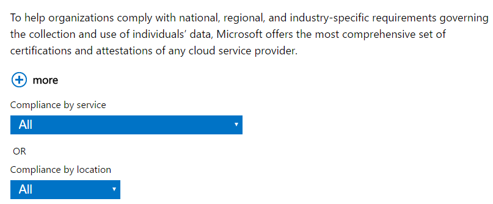

# Authoring content for Open Publishing ##
This topic will contain information you need to know when authoring Trust Center China content in Open Publishing repository. 

1. All the possible layout of trust center site shares the same header and footer, so this part has been extracted as template.


2. Include the yml header and add layout: AzurePortalPage metadata in every markdown file, this is how OP includes the above template.
```
---
layout: AzurePortalPage
---
```

3. Considering the complexity of the page, you need to author other part of page by modifying the html. div id or class is your friend to find which html part you need to edit. I list some of the parts for your reference.

- HeaderWrapper or hero wrapper, it is the hero section to draw attention to key information, include several background images and inline text. Add more "li" tag in "ul" tag to include more slide.
```
<div id="HeaderWrapper" data-cols="1" data-view1="1" data-view2="1" data-view3="1" data-view4="1" class="row-fluid wider hero grid-container">
```


- Breadcrumbs Wrapper, it is the breadcrumbs section of the page, edit it to provide user navigation inside your site.
```
<div id="BreadcrumbsWrapper" data-cols="1" data-view1="1" data-view2="1" data-view3="1" data-view4="1" class="row-fluid grid-container mscom-grid-container breadcrumbs">
```


- Content Wrapper, main part of the page, you can include more image wrapper and text wrapper in this part.
```
<div id="ContentWrapper" data-cols="2" data-view1="1" data-view2="2" data-view3="2" data-view4="2" class="row-fluid subpageBody">
```


- SideBar Wrapper, provide side bar such as helpful information and external links
```
<div id="SideBarWrapper" data-cols="1" data-view1="1" data-view2="1" data-view3="1" data-view4="1" class="row-fluid">
```
