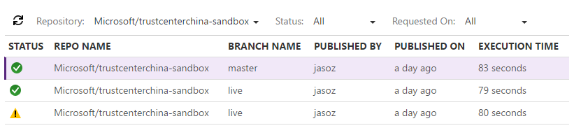
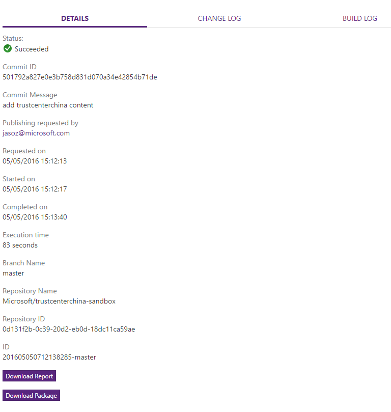

# Content build and preview

Alike other systems, publishing to stage and live is done via branch management. Thus, you can assign one branch to be your staging branch, and another to be your live branch.

We recommend users work on master branch in most of phase and merge to live branch after master branch's code is fully tested.

In general:

- **master** branch is the branch associated with staging.
- **live** branch is the production branch associated with live.

Note that this means that once the content is committed to one of the corresponding branch, the content will automatically get published to their assigned environment. 

## Trigger content publishing

+ Auto publish on content update in Git repo

Once the repo is provisioned, OPS monitors changes in the repo and publishes the contents in updated branch automatically.

## Build status and reports

+ Build history on OPS portal

Teams can look at the [OPS portal](https://op-portal-sandbox.azurewebsites.net/#/containers/repository/repositories/All). for build status and logs of current and past builds.

For each entry in the Build history, you may find build status, change log and build log on the right panel.

