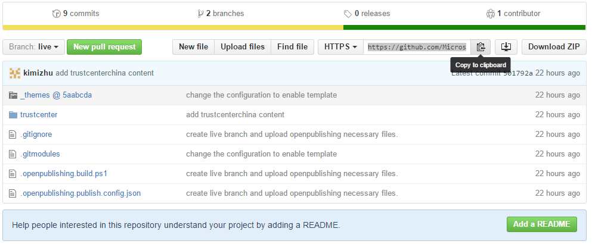
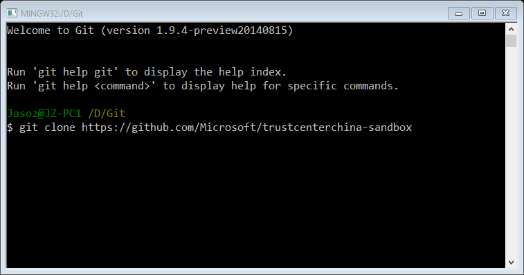
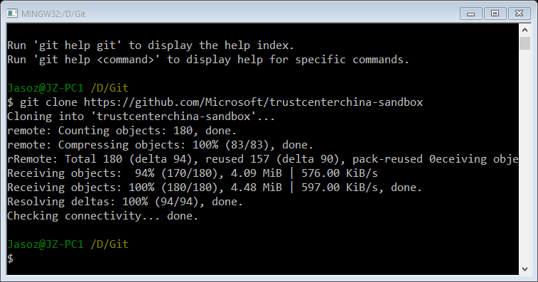

# Cloning the GIT repos
Open Publishing (OP) is the content authoring and publish workflow based on markdown and Git. To get started, you need first clone the remote git repo to local. 

Trust Center China homepage is hosted on GitHub. So if you are not familiar with GitHub, check out a summary of [GitHub glossary](https://help.github.com/articles/github-glossary/) used in this documentation as well as the [GitHub tutorials](https://github.com/)

##1. Cloning the repo
When you create a repository on GitHub, it exists as a remote repository. You can clone your repository to create a local copy on your computer and sync between the two locations.
1. On GitHub, navigate to the main page of the repository.

2. Under your repository, copy the clone URL for the repository.

3. Open Git Bash.

4. Change the current working directory to the location where you want the cloned directory to be made.

5. Type git clone, and then paste the URL you copied in Step 2.

6. Press Enter. Your local clone will be created.
