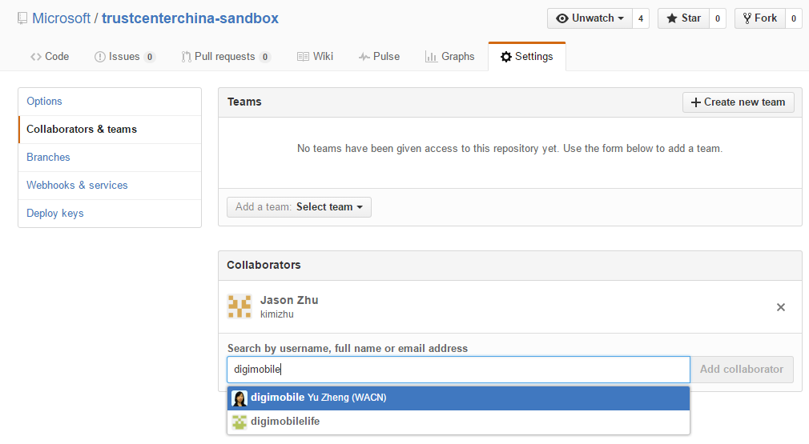

# Configuring the repos
It is the content owner's responsibility to provide the right permissions to the users to access repositories. There are two ways to manage the permission on Github repo.

- Manage permission in Open Source Hub portal (recommended).
- Manage permission in GitHub.

## 1. Manage permission in Open Source Hub portal
We recommend that user create the repo in the Microsoft GibHub Organization. That way, all Microsoft repos are together in a single GitHub organization. Also you can benefit of all the advantages the organization provides such as permission control. 

First, you will have to join the Microsoft GitHub organization. [Here is how](https://www.1eswiki.com/wiki/How_to_Join_the_Microsoft_GitHub_Organization).
Then, you can manage the permission in Open Source Hub, find your team in [Manage Teams](https://opensourcehub.microsoft.com/manage-teams) and do operation such as adding members and grant permissions.

## 2. Manage permission in Github
1. Ask for the username of the person you're adding as a collaborator.
2. On GitHub, navigate to the main page of the repository.
3. Under your repository name, click Settings.
4. Click the "Collaborators & teams" tab.
5. Start typing the collaborator's username.
6. Select the user from the drop-down menu.

7. Click Add collaborator.